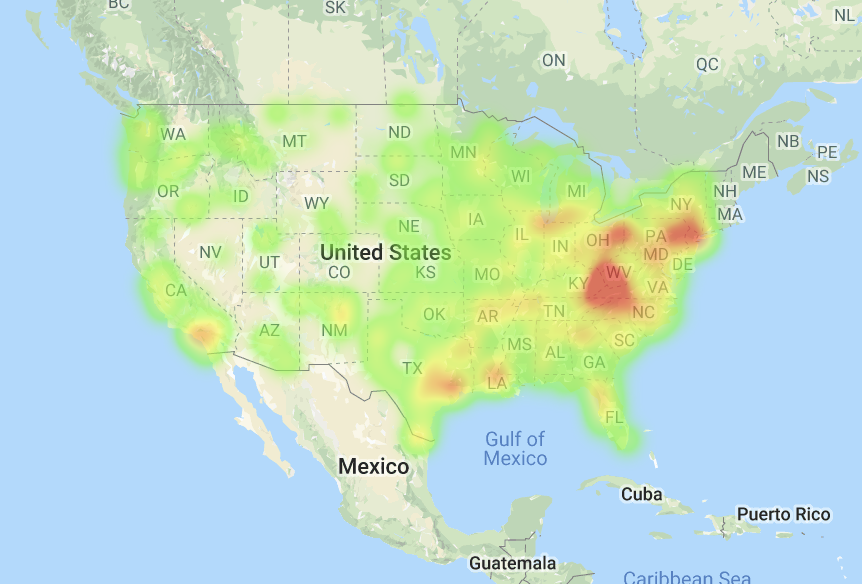

# Banking Deserts Heatmap

* Sample Activity an Example, where the task is to answer the question: "What is the relationship between poverty, age, and population with the number of banks in a given area?" To help accomplish this task, you've been given census data for every zip code across the country. We will also visualize this data by creating layered maps with Google maps.

## Steps

* Using [zip_bank_data.csv](Resources/zip_bank_data.csv) and new knowledge of the US Census API, we add a column for Poverty Rate to the csv.

* Using `gmap` we create the following three figures:

  * A map with a `heatmap_layer` of the poverty rate for each city.
    

  * A map with a `symbol_layer` for the number of banks located at that city.
    

  * A map that includes both the poverty `heatmap_layer` and the bank `symbol_layer`.
    

* Summary statistics for poverty rate, bank count and population is displayed.

* We create a scatter plot with linear regression for **bank count** vs. **poverty rate**.

  * Be sure NaN values are dropped from the DataFrame.

  * Plot the data points.

  * Plot the linear regression line.

  * Print the R-squared value.

* Write a sentences describing your findings. Were they what you expected? What other factors could be at play?

* The Census API uses code `B17001_002E` for poverty rates.

* For reference, use the docs for the [layers](http://jupyter-gmaps.readthedocs.io/en/latest/api.html#figures-and-layers) and as a [refresher](http://jupyter-gmaps.readthedocs.io/en/latest/tutorial.html) for setting up the maps.

* last step is to format the info boxes

Data Source: [Census Data](https://www.census.gov/developers/).
