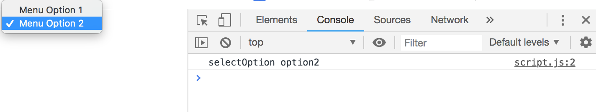

# An Eventful Click

## Instructions

Modify your starter code so that when an item in the dropdown menu in `index.html` is selected, the following are printed to the console:

* The `id` of the dropdown menu

* The `value` of the dropdown menu item

## Hint

Consult [W3Schools documentation](https://www.w3schools.com/tags/tag_select.asp) for a refresher on dropdown menus.

---

© 2021 Trilogy Education Services, LLC, a 2U, Inc. brand. Confidential and Proprietary. All Rights Reserved.

